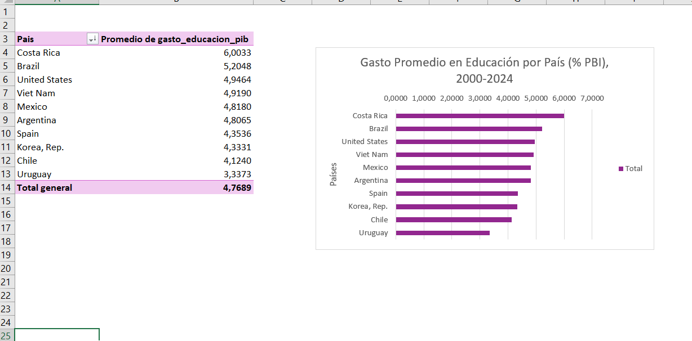
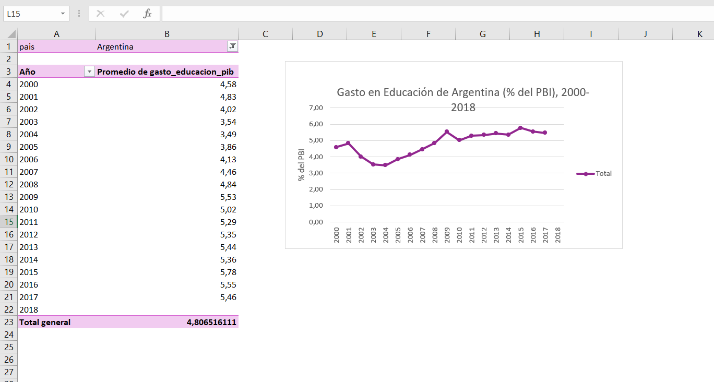
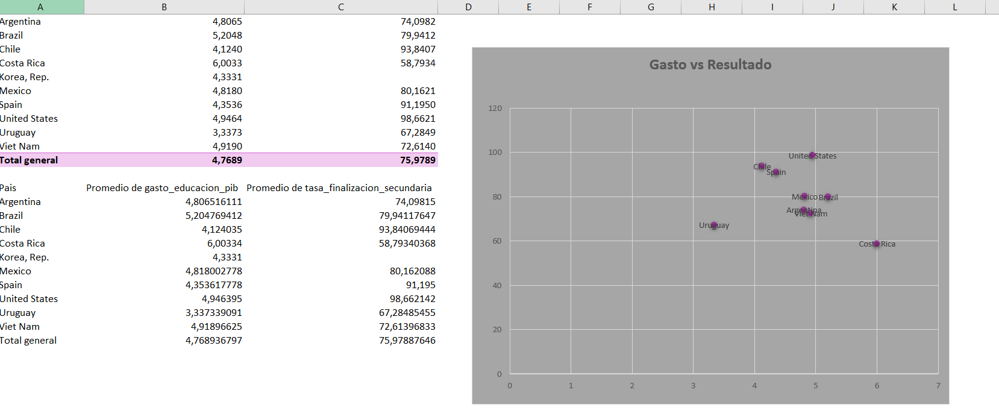

# Gasto en Educación y Resultados: Argentina en Perspectiva Regional e Internacional

Análisis exploratorio sobre si el gasto público en educación se traduce en mejores resultados educativos, comparando Argentina con 9 países de referencia (Brasil, Chile, Costa Rica, Corea del Sur, México, España, Estados Unidos, Uruguay y Vietnam).

## Pregunta de investigación

¿Los países que más invierten en educación (% del PBI) obtienen mejores resultados en finalización de primaria y secundaria? ¿Dónde se ubica Argentina en esa comparación?

## Fuente de datos

[World Bank - Education Statistics](https://databank.worldbank.org/source/education-statistics-%5E-all-indicators), período 2000-2024.

**Indicadores utilizados:**
- Gasto público en educación (% del PBI)
- Tasa de finalización de educación primaria (%)
- Tasa de finalización de educación secundaria básica (%)
- Tasa de alfabetización adulta, 15+ años (%)

## Metodología

1. **Extracción**: descarga de datos desde World Bank DataBank en formato CSV
2. **Limpieza**: eliminación de filas de metadata, conversión de formato ancho (años en columnas) a formato largo, tratamiento de valores faltantes 
3. **Análisis**: consultas SQL sobre base SQLite para calcular promedios, rankings y comparaciones entre indicadores
4. **Visualización**: gráficos en Excel a partir de tablas dinámicas

## Hallazgos principales

### 1. Argentina invierte por encima de la media, pero no lidera

Argentina destina en promedio **4.81% del PBI** a educación (puesto 6 de 10), por encima de países como España (4.35%) o Chile (4.12%), pero por debajo de Costa Rica (6.00%) y Brasil (5.20%).

### 2. El gasto en Argentina se recuperó de forma sostenida tras 2003

Se observa una caída marcada entre 2000 y 2003 (coincidente con la crisis económica de esos años), seguida de una recuperación sostenida hasta estabilizarse alrededor del 5.4-5.8% desde 2015.

### 3. Gastar más no garantiza mejores resultados — el caso Costa Rica

Este es el hallazgo central del análisis: **no existe una relación lineal clara entre gasto y resultados**.

- **Costa Rica** es el país que más invierte (6.0% del PBI) pero tiene la **tasa de finalización de secundaria más baja** del grupo (58.8%).
- **Chile** y **España** logran tasas de finalización superiores al 90% con niveles de gasto medios (4.1% y 4.35% respectivamente).
- **Estados Unidos** combina gasto medio-alto (4.95%) con el mejor resultado del grupo (98.7%).

### 4. Brecha entre primaria y secundaria: Argentina pierde ~18 puntos

Al comparar la tasa de finalización de primaria contra la de secundaria por país, Argentina muestra una brecha de **18.16 puntos porcentuales** — es decir, una porción significativa de quienes terminan la primaria no llega a completar la secundaria básica. Brasil, Chile y Estados Unidos muestran brechas mucho menores, lo que indica mejor retención en la transición entre niveles.

## Conclusión

El presupuesto educativo importa, pero **no es el único factor que explica los resultados**. Casos como Chile o Estados Unidos sugieren que la eficiencia en el uso de los recursos —y no solo su magnitud— juega un rol clave. El caso de Costa Rica es una señal de alerta: alta inversión no siempre se traduce en mejor retención escolar. Para Argentina, el dato más preocupante no es el nivel de gasto, sino la brecha entre primaria y secundaria, que apunta a un problema de retención en el nivel medio.

## Limitaciones

- Los datos combinan años distintos por país según disponibilidad de reporte; no se realizó seguimiento de cohortes reales.
- La "brecha primaria-secundaria" es una aproximación basada en promedios históricos (2000-2024), no una medición de la misma cohorte de estudiantes a lo largo del tiempo.
- Corea del Sur (Korea, Rep.) presenta datos incompletos para varios indicadores en el período analizado.

## Herramientas utilizadas

SQL (SQLite) · Excel (tablas dinámicas y gráficos) · World Bank DataBank
